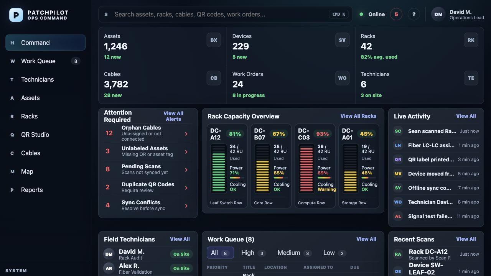
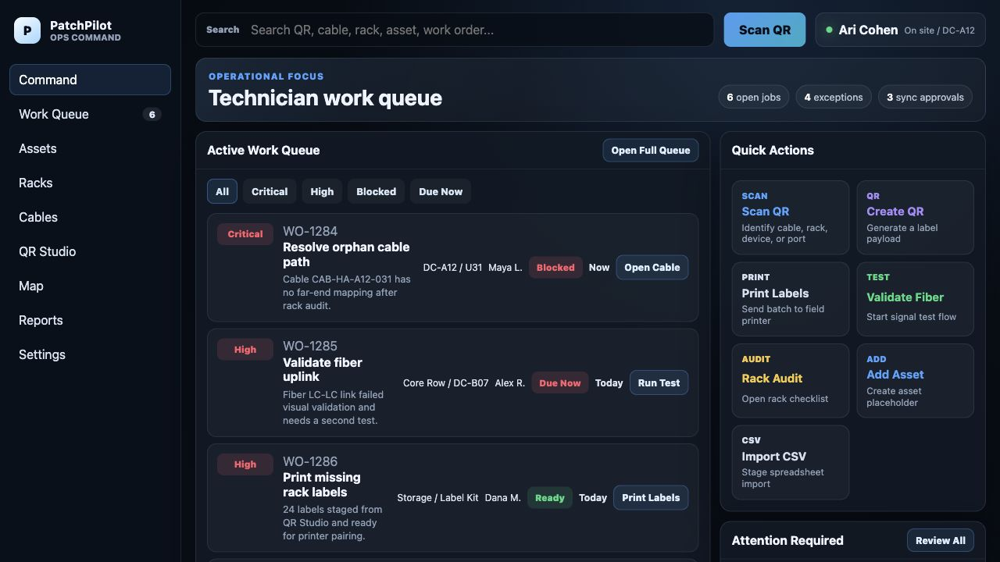
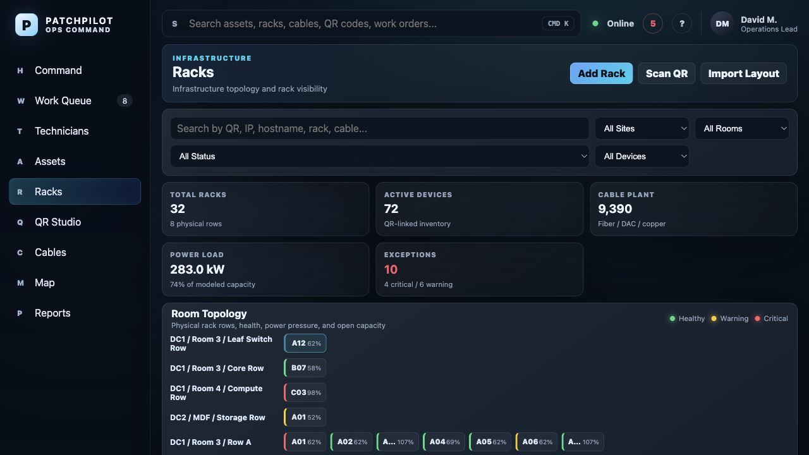
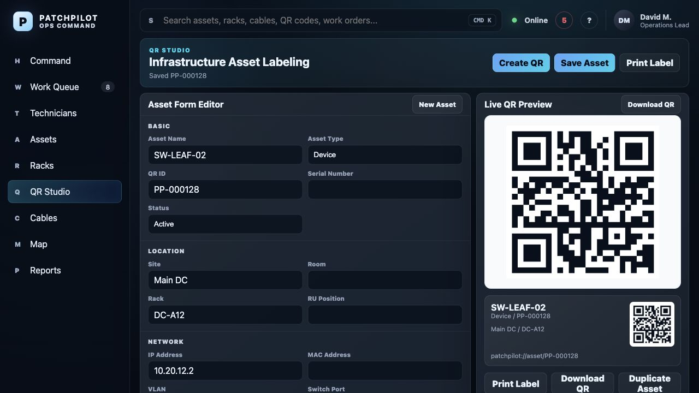
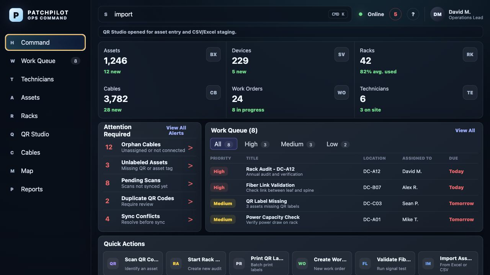

# PatchPilot Dashboard

<p>
  <strong>Field operations dashboard for PatchPilot infrastructure teams.</strong>
</p>

<p>
  
  
  
  
</p>



Browser dashboard for PatchPilot operations.

## Preview

| Operations Command | Rack Workspace |
| --- | --- |
|  |  |

| QR Studio | Quick Actions |
| --- | --- |
|  |  |

More screenshots are available in [`docs/screenshots`](docs/screenshots).

## Scope

- Vite + React web dashboard
- Overview metrics
- Technician status list
- Asset search and status filter
- QR payload preview workflow
- Rack operations workspace

## Tech Stack

- React 19
- TypeScript
- Vite
- CSS modules by surface under `app/`

## Run Locally

```bash
npm install
npm run dev
```

The local server defaults to `http://localhost:3000`.

## Build

```bash
npm run build
npm run start
```

`npm run build` creates the static production bundle in `dist/`.

## Deploy

Any static host or Node server that can run a Vite build can serve this dashboard.

```bash
git clone https://github.com/x2vmbwtsjf-afk/patchpilot-dashboard.git
cd patchpilot-dashboard
npm install
npm run build
```

For a simple preview server:

```bash
npm run start
```

## Future Integration Points

- Replace mock arrays in `app/page.tsx` with API calls.
- Add authentication before exposing real operational data.
- Add QR generation service or client-side QR rendering.
- Add rack layout editing and RU mapping.
- Add a sync contract between the iOS app and the dashboard backend.
